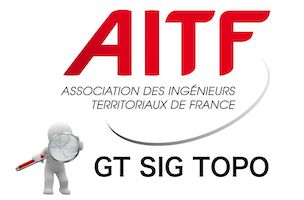

## À propos de cette page

Vous trouverez ici des ressources de références relatives à la thématique voies et adresses. Ces ressources ont été créées pour les besoins des géomaticiens (et des techniciens dans leur ensembles) des collectivités territoriales qui ont besoin de gérer des données voies-adresses.

Le groupe de travail produisant ces ressources é été créé intialement en juin 2015 pour accompagner le projet de Base Adresse Nationale (BAN).

## Des voies et des adresses

[def voies et adresses]

## Les procédures légales et les bonnes pratiques en vigueur

Ce document essaie d'être le document le plus complet en ce qui concerne le référencement des textes réglementaires (ou quasi réglementaires) qui s'imposent aux collectivités territoriales sur le sujet des voies et des adresses.
La première partie recense donc les textes réglementaire (lois, décret, etc) ainsi que la jurisprudence administrative qui modèle le droit en la matière.

La deuxième partie du document est une analyse de différents concepts et actions qui sont de la responsabilité des communes sur le sujet de la dénomination des voies de de l'adressage. Des propositions d'évolutions concluent cette partie.

La troisième partie du document s'attache à recenser les bonnes pratiques reconnaues en matière de dénomination et d'adressage. Ces recommandations sont à la fois méthodologiques, organisationelles et techniques.

Télécharger "Voies et adresses : les procédures légales et les bonnes pratiques en vigueur - version 1.1 juin 2020" (PDF)

## Proposition d'évolution de la réglementation

La dénomination des voies et l’adressage sont une compétence des communes reconnue au travers du décret 94-1112 (publicité foncière) et de l’article L2213-28 du Code général des collectivités territoriales (numérotation). Néanmoins, l’état réglementaire qui pèse en 2020 sur les communes est un héritage de 200 ans de textes divers et variés qui ne sont plus en phase avec les pratiques réelles et les enjeux, notamment au regard des attentes en matière de données numériques de référence.

Les propositions contenues dans la dernière partie de ce document concourent à faire reconnaître la commune comme seule entité en capacité de produire une information voie- adresse officielle et opposable à des tiers. Á ce titre, elles sont une réponse à la proposition n° 22 du rapport de la députée Valéria FAURE-MUNTIAN sur les données géographique souveraines.

En 2020 l’informatisation étant systématique, ces informations voies-adresses se doivent d’aboutir à la diffusion en open-data de ces base d’adresses locales, prérequis à la constitution de toute base de donnée agrégée de niveau national.

Ce document est le fruit d'une collaboration entre l'AITF et l'AFIGESE et a été élaboré dans le cadre de l'appel à contribution de France Urbaine afin de participer à la concertation sur la future loi « 3D : différenciation, décentralisation, déconcentration » qui sera examinée par le parlement à l'automne 2020.

Télécharger Contribution dans le cadre de la concertation sur la future loi « 3D : différenciation, décentralisation, déconcentration » - version 1.3 mars 2020" (PDF)

## Format Base Adresse Locale (BAL)

…

## Aide, support, contact

Maël REBOUX (Ville de Rennes / Rennes Métropole)
Chantal ARRUTI (Ville de Bayonne / Communauté d'agglomération du Pays Basque)

