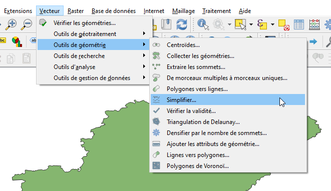
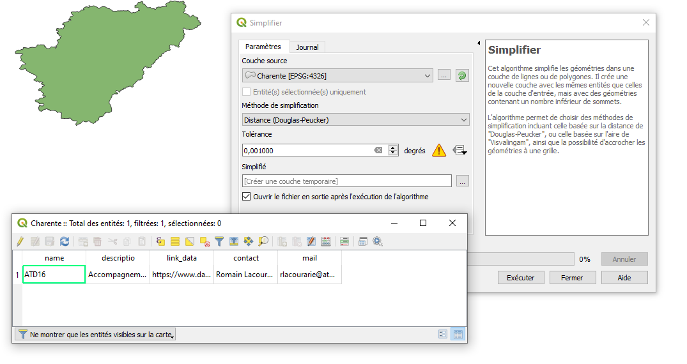
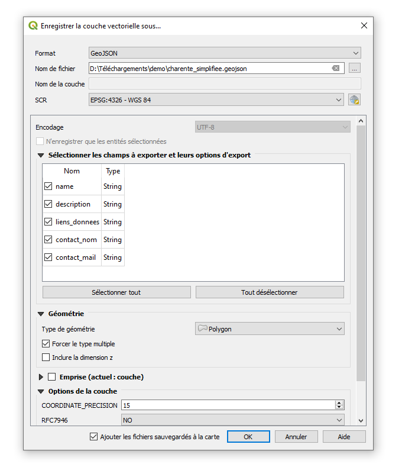
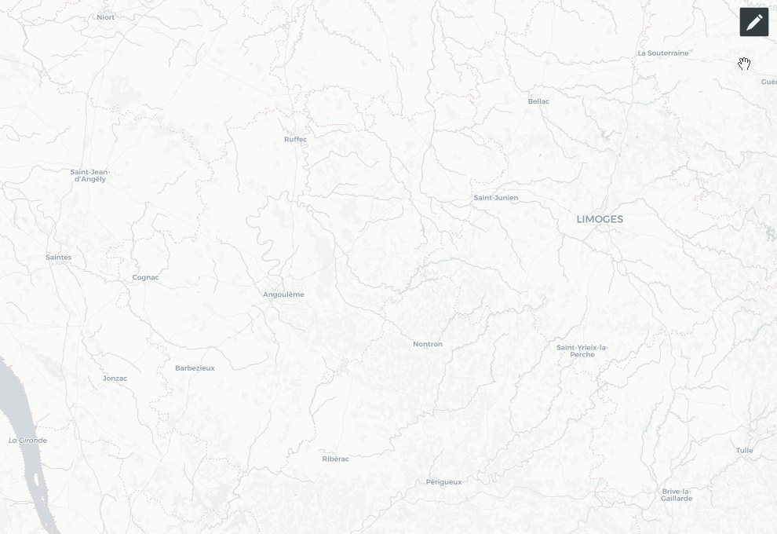

##  Comment compléter la carte des démarches d'adressage

La carte ci-dessous recence les organisations qui se déclarent en tant que chef de file territorial sur l'adresse sur leur territoire de compétence.

<iframe width="100%" height="500px" frameborder="0" allowfullscreen src="//umap.openstreetmap.fr/fr/map/carte-des-demarches-dadressage-en-france_261912?scaleControl=false&miniMap=false&scrollWheelZoom=false&zoomControl=true&allowEdit=false&moreControl=true&searchControl=null&tilelayersControl=null&embedControl=null&datalayersControl=true&onLoadPanel=undefined&captionBar=false"></iframe>

Voici un tutoriel pour modifier / corriger compléter les données de la carte.

##  Préparer vos données avec QGIS

La carte montre des polygones qui correspondent au terrtoire de compétence de chaque chef de file sur un territoire sur lequel il est légitime.

Il convient donc de préparer un fichier GeoJSON contenant un polygone (ou un multiploygone si nécessaire), projeté en WGS84 (EPSG:4326) et très simplifié (on visionne ça à l'échelle nationale !).

En résumé :
- fichier GeoJSON
- polygone / multipolygone
- WGS84
- géométries très simplifiées
- attributs :
  - name = nom de votre structure
  - description = description succinte de votre démarche, votre organisation, etc.
  - liens_donnees = lien vers une page permettant d'accéder à vos données voies-adresses
  - contact_nom = nom de la personne en point de contact / animation
  - contact_mail = courriel de la personne en point de contact / animation

**Voici [un fichier modèle](files/umap_modele.geojson) à utiliser.**
Note : "name" est un attribut obligatoire pour umap.

Nous recommandons d'utiliser QGIS pour simplifier les géométries.

[]

[

Une fois la nouvelle couche obtenue : créer les attributs comme spécifié plus haut et compléter.

Exporter en GeoJSON et en WGS84.

[]

##  Téléverser dans umap

Ouvrir la carte umap [https://umap.openstreetmap.fr/fr/map/carte-des-demarches-dadressage-en-france_261912#](https://umap.openstreetmap.fr/fr/map/carte-des-demarches-dadressage-en-france_261912#)

- Cliquez sur le bouton "crayon" en haut à droite pour passer en mode de modification.
- Cliquez sur le bouton "Importer" des données.
- Choisir le fichier geojson créé précédemment
- Vérifier les paramètre d'import : geojson vers la couche "territoires"
- Cliquer sur le polygone et vérifier si les données sont bien présentes
- Fermer le calque puis enregistrer les modifications
- Sortir du mode d'édition

[]

